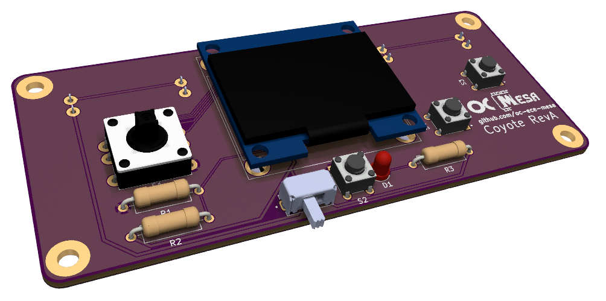
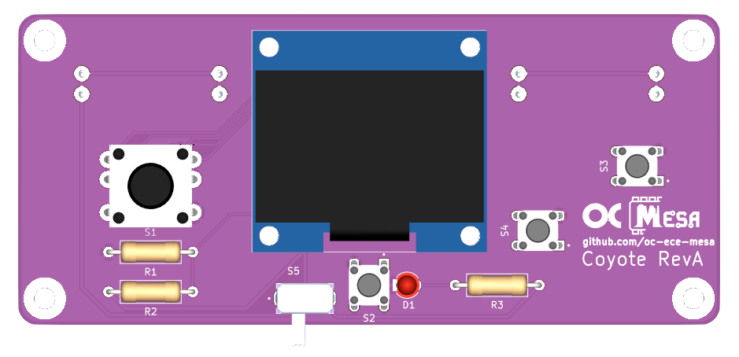

# MESA Coyote

    
    

Coyote is a handheld game system that uses the MESA Basalt devboard.

The case for the Coyote is called "Roadrunner" and can be found [here](https://github.com/oc-ece-mesa/mesa-roadrunner).
